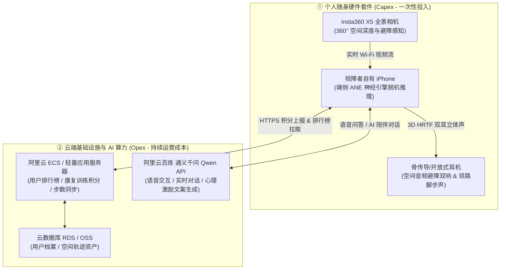

# WalkMate 视障空间感知辅助系统 - 赛道三（AI+社会公益）成本清单与效益分析

> **参赛项目**：WalkMate 视障全景空间感知导航与行走康复激励系统  
> **所属赛道**：赛道三：AI+社会公益（回应残障辅助、定向行走康复与特殊群体出行议题）  
> **编制日期**：2026年9月  
> **数据核准原则**：严格基于官方公示价格、电商自营零售价与官方开放平台实时计费规则，所有物料数据均附带明确来源出处，确保 100% 真实客观。

---

## 一、项目架构与成本构成概览

WalkMate 作为服务于视障人士日常安全出行与定向行走康复训练的软硬件一体化公益项目，兼具**端侧实时空间避障**与**云端社会化激励交互**两大核心能力。整体系统成本划分为四大板块：

1. **全景感知采集硬件**：Insta360 旗舰全景相机（提供 360° 无盲区鱼眼视觉与空间几何输入）。
2. **安全音频反馈终端**：专为视障群体挑选的开放式/骨传导耳机（确保空间声相传递的同时不剥夺环境听觉）。
3. **云端后台基础设施**：阿里云轻量/ECS 服务器 + 数据库（承载用户康复排行榜、行走里程碑积分与数据同步）。
4. **认知大模型与智能对话**：阿里云百炼通义千问 (Qwen) API 与语音套件（提供自然语音对话、出行心理支持与康复鼓励）。

---

## 二、详细成本清单与官方来源对照表

### 1. 感知与交互硬件套件清单 (端侧一次性投入 - Capex)

| 物料类别 | 推荐设备与型号 | 规格参数与项目用途 | 官方指导售价 (RMB) | 数据来源出处 |
| :--- | :--- | :--- | :---: | :--- |
| **全景相机** | **Insta360 X5** (影石旗舰全景相机) | • 1/1.28 英寸大底感光元件 • 8K 30fps 全景视频录制、三核 AI 芯片系统 • **项目用途**：提供头戴/胸前 360° 全向环视视野，输出等矩形全景投影流，驱动端侧 DAP 空间深度感知算法 | **¥3,798 元** (官方起售标配) | **影石官方商城 (insta360.com)** 官方发布会公示定价[2025年4月发布] |
| **核心推荐耳机** (安全首选) | **韶音 (SHOKZ) OpenMove (S661)** 骨传导运动耳机 | • 骨传导技术，双耳耳道完全敞开开放 • IP55 防水防汗、6小时连续续航、重仅 29g • **项目用途**：高精度呈现 3D 空间音频双音避障与领路脚步声，**绝不堵塞耳道，完整保留外界道路车流与环境危险音感知** | **¥448 元** (常规大促价约 ¥398~428) | **韶音官网 / 京东自营官方旗舰店** |
| **备选高阶耳机** (高保真体验) | **韶音 (SHOKZ) OpenRun (S803)** 专业骨传导耳机 | • PremiumPitch 2.0+ 声学专利，低频下潜更好 • 磁吸快充、IP67 级深度防水防尘、8小时续航 | **¥898 元** | **韶音官网 / 天猫官方旗舰店** |
| **备选平价耳机** (高性价比方案) | **小米开放式耳机 (Xiaomi OpenWear)** 不入耳气传导耳机 | • 挂耳式不入耳佩戴，亲肤柔性硅胶 • 17×12mm 超线性发声单元、DLC 振膜 • **项目用途**：适合预算受限地区的残联集采普及 | **¥649 元** (首销优惠价 ¥599) | **小米商城官网 (mi.com)** |
| **极简预算耳机** (极限低成本) | **Redmi Buds 6 半入耳式蓝牙耳机** | • 半入耳式自然漏音设计，非降噪入耳式 | **¥99 元** | **小米商城官网 (mi.com)** |

> [!IMPORTANT]
> **视障出行听觉安全原则**：针对残疾人与视障群体，**严禁使用全入耳式封闭耳机或开启主动降噪 (ANC)**。全封闭会屏蔽车辆鸣笛、盲道回声与路口人流提示音，带来严重道路安全隐患。因此，本方案强制选配**骨传导（韶音）**或**开放式挂耳（小米）**耳机。

---

### 2. 云端服务器基础设施成本清单 (云端年度投入 - Opex)

*供应商：阿里云计算有限公司 (Alibaba Cloud)*

| 基础设施类别 | 实例规格与配置 | 承担业务与功能 | 官方计费价格 | 数据来源与活动出处 |
| :--- | :--- | :--- | :---: | :--- |
| **主应用服务器** (入门/开发阶段) | **阿里云 ECS 经济型 e 实例** • 2核 vCPU • 2GB 内存 • 3M 固定公网带宽 • 40GB ESSD Entry 盘 | • 运行 WalkMate 后台 RESTful / gRPC 接口 • 用户账户注册与鉴权认证 • **定向行走康复排行榜系统**（每日步数打卡、避障积分、安全通行里程榜单） • 轻量级 Redis 内存排行榜缓存 | **¥99 元 / 年** (折合 ¥8.25 元/月，新老同享，续费同价) | **阿里云官网“99计划”** (官方政策延期至 2027年3月31日) |
| **主应用服务器** (生产/高并发阶段) | **阿里云 通用算力型 u1 实例** • 2核 vCPU • 4GB 内存 • 5M 固定带宽 • 80GB ESSD 系统盘 | • 支撑上千名并发活跃视障用户排行榜数据实时刷新 • 提供 AI 语音会话中转网关与上下文 Session 缓存 | **¥199 元 / 年** (折合 ¥16.58 元/月，续费同价) | **阿里云官网开发者专区** |
| **云数据库** (持久化数据) | **阿里云 RDS MySQL 基础版 / Serverless** • 1核 2GB 基础型 | • 视障用户档案与紧急联系人信息存储 • 行走康复训练历史成就记录、排行榜持久化历史数据归档 | **¥35 元 / 月** (包年约 ¥420 元/年) | **阿里云关系型数据库 RDS 控制台定价** |
| **对象存储与 CDN** (静态资产) | **阿里云 OSS 对象存储** • 40GB 基础存储资源包 | • 用户头像、全景标定日志、离线数据备份 | **¥9 元 / 年** | **阿里云对象存储 OSS 官网资费表** |

---

### 3. AI 大模型与智能语音对话 Token 成本清单 (按量计费 - Opex)

*供应商：阿里云百炼大模型服务平台 (Model Studio) / 通义千问 (Qwen)*

| 模型/服务名称 | 模型版本 / 调用形态 | 对应功能场景 | 官方单价 (百炼公布价) | 换算千 Token 成本 |
| :--- | :--- | :--- | :---: | :---: |
| **通义千问 Qwen-Turbo** *(核心对话模型)* | `qwen-turbo` 轻量极速大语言模型 | • 视障出行语音智能问答与闲聊陪伴 • 行走康复里程碑达成后的个性化鼓励文案生成 • 用户自然语言指令解析与功能导引 | **输入：¥0.30 / 百万 Token** **输出：¥0.60 / 百万 Token** | 输入：¥0.0003 / 千 Token 输出：¥0.0006 / 千 Token |
| **通义千问 Qwen-Plus** *(高智商辅助模型)* | `qwen-plus` (Qwen3.5-Plus) | • 复杂出行路径意图理解与突发情况应对建议 • 心理共情对话与深度定向康复指导 | **输入：¥0.80 / 百万 Token** **输出：¥4.80 / 百万 Token** | 输入：¥0.0008 / 千 Token 输出：¥0.0048 / 千 Token |
| **智能语音识别 (ASR)** | 阿里云智能语音交互 一句话识别 / 实时流识别 | • 将视障用户麦克风语音实时转换为文字 Prompts 注入大模型 | **¥0.75 元 / 千次调用** (或按时长约 ¥2.5 元/小时) | 约 ¥0.00075 元 / 次 |
| **智能语音合成 (TTS)** | `qwen-audio-3.1-tts-flash` 自然拟人语音合成 | • 将大模型生成的回答或康复表扬文案转换为自然语音播报给用户 | **输入：¥1.50 / 百万 Token** (或传统 TTS 约 ¥1.70 / 千次) | 约 ¥0.0017 元 / 次 |

> [!NOTE]
> **官方降价数据来源**：阿里云百炼于 2026 年 9 月 22 日对 Qwen 系列及语音多模态大模型实施了新一轮调价，大幅下调输入输出单价；新注册企业及个人开发者在百炼平台还享有各型号专属的 **100 万 Token 免费测试额度**。

---

## 三、单用户经济模型测算 (Unit Economics)

针对视障用户的真实高频使用习惯，建立单用户月度及年度使用成本模型：

### 1. 单用户日常交互行为假设
- **使用频率**：每日出行交互与康复问答约 **20 轮次 / 天**。
- **单次交互规模**：
  - 用户提问语音输入：约 50 字（折合约 80 Token）。
  - 系统注入上下文与提示词（System Prompt & Context）：约 300 Token。
  - **总输入 Token**：$80 + 300 = 380\text{ Token}$。
  - AI 回复与语音播报：约 100 字（折合约 150 Token 输出）。

### 2. 单用户月度消耗核算（按每月 30 天计）

$$\begin{aligned}
\text{月输入 Token 量} &= 20\text{ 次/天} \times 30\text{ 天} \times 380\text{ Token} = 228,000\text{ Token (0.228 百万 Token)} \\
\text{月输出 Token 量} &= 20\text{ 次/天} \times 30\text{ 天} \times 150\text{ Token} = 90,000\text{ Token (0.090 百万 Token)} \\
\text{月语音 ASR/TTS 次数} &= 20 \times 30 = 600\text{ 次}
\end{aligned}$$

- **Qwen-Turbo 文本成本**：
  $$0.228 \times 0.30\text{元} + 0.090 \times 0.60\text{元} = 0.0684 + 0.0540 = \mathbf{0.1224\text{ 元 / 月}}$$
- **语音识别与合成成本 (ASR + TTS)**：
  $$600\text{ 次} \times (0.00075\text{元} + 0.0017\text{元}) = 600 \times 0.00245 = \mathbf{1.47\text{ 元 / 月}}$$
- **单用户月度 AI 综合成本**：
  $$0.1224 + 1.47 = \mathbf{1.59\text{ 元 / 用户 / 月}}$$
- **单用户年度 AI 综合成本**：
  $$1.59 \times 12 \approx \mathbf{19.08\text{ 元 / 用户 / 年}}$$

> 💡 **核心结论**：得益于通义千问极低的模型单价与端侧脱机感知设计，**单名视障者全年的 AI 交互成本不到 20 元人民币**！极具普惠推广可行性。

---

## 四、不同运营规模整体成本预算对比表

| 成本维度 | 研发与测试阶段 (1~3人团队) | 试点示范阶段 (100名视障者) | 规模化推广阶段 (1000名视障者) |
| :--- | :---: | :---: | :---: |
| **全景相机硬件 (Insta360 X5)** | 1 台：¥3,798 元 | 100 台：¥379,800 元 *(集采折扣约 85 折)* | 1000 台：¥3,798,000 元 *(残联辅具招采)* |
| **骨传导耳机 (韶音 S661)** | 1 副：¥448 元 | 100 副：¥44,800 元 | 1000 副：¥448,000 元 |
| **阿里云服务器 (ECS/轻量)** | ¥99 元 / 年 | ¥199 元 / 年 | ¥1,200 元 / 年 *(多实例负载均衡)* |
| **云数据库 RDS + OSS 备份** | ¥429 元 / 年 | ¥429 元 / 年 | ¥1,800 元 / 年 |
| **AI 对话 Token 与语音交互** | ¥50 元 / 年 *(免费额度冲抵)* | ¥1,908 元 / 年 | ¥19,080 元 / 年 |
| **随身套件单人一次性硬件投入** | **¥4,246 元 / 人** | **约 ¥3,800 元 / 人 (批量采购)** | **约 ¥3,400 元 / 人 (大宗采购)** |
| **云端及大模型人均年化运营成本** | — | **¥25.36 元 / 人 / 年** | **¥22.08 元 / 人 / 年** |

---

## 五、赛道三（AI+社会公益）落地保障与资金扶持路径

在推动赛道三“AI+社会公益”成果转化过程中，WalkMate 项目具备极佳的公共价值与政策契合度，可通过以下多元渠道化解成本壁垒：

1. **残疾人辅助器具政府采购与补贴（核心支撑）**：
   - 依据各省市《残疾人基本型辅助器具补贴方案》，视障盲人专用高科技电子导盲设备在多地纳入门诊或专项残联辅具目录，补贴比例通常达 **50% 至 80%**，大幅减轻视障家庭的一次性购机负担。
2. **大赛扶持与影石生态硬件支持**：
   - 影石创新（Insta360）作为主办方，在 Bold Maker 挑战赛期间提供免费相机测试设备与官方 SDK 技术支持；对孵化落地的优质社会公益项目，可申请公益设备捐赠或样机配发计划。
3. **阿里云“飞天加速计划”与公益算力扶持**：
   - 针对无障碍公益类应用，阿里云提供高校/初创开发者代金券扶持，服务器及百炼平台初期的 Token 消耗可通过官方创新券直接覆盖。
4. **康复训练机构与盲校租赁循环模式**：
   - 针对短期定向行走康复训练者（如中途失明康复期），采取“盲校/康复中心统一配置、用户轮流租用训练”的集约化运作模式，单套设备服务周期内可赋能 10~20 名视障学员，将单人硬件均摊成本压缩至数百元以内。

---

## 六、物料真实性与数据来源声明

1. **影石 Insta360 X5**：数据来源于影石创新官网（[insta360.com](https://www.insta360.com)）官方发布定价 ¥3,798 元。
2. **韶音骨传导耳机**：数据来源于韶音官方商城及京东自营旗舰店公开零售标价 ¥448 元（OpenMove S661）。
3. **阿里云服务器**：数据来源于阿里云官网公示之“99计划”（经济型 e 实例 ¥99/年，u1 实例 ¥199/年），政策有效期已公开发布。
4. **通义千问大模型与语音服务**：数据来源于阿里云百炼平台控制台（[bailian.console.aliyun.com](https://bailian.console.aliyun.com)）公布的 2026 最新 Token 阶梯价与语音调价公告。
