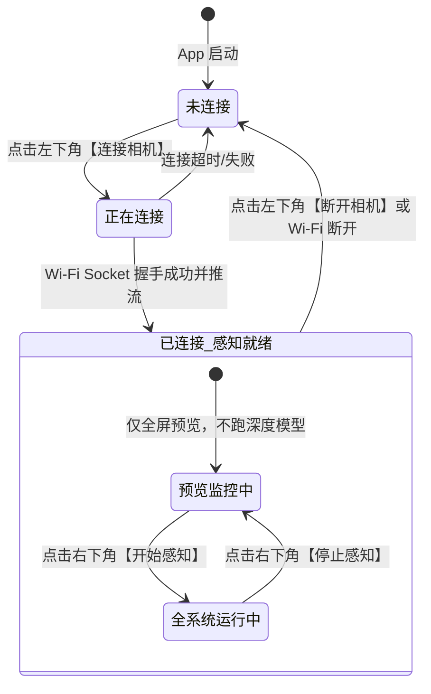

# 数据模型与控制状态：003-minimal-field-pilot 极简真机实测

**特性分支**: `003-minimal-field-pilot`  
**关联规范**: [`specs/003-minimal-field-pilot/spec.md`](./spec.md)  
**状态**: Approved

---

## 实体与状态模型

### 1. 极简实测主控制状态 (PilotControlState)

负责维持用户界面双按钮交互与底层相机、感知引擎的组合运行状态机：

#### 属性契约：
- **`connectionState: CameraConnectionState`**（现有枚举：`.noConnection`, `.connecting`, `.connected`, `.failed`）
  - 控制左下角按钮标题、背景色与图标；
  - 决定右下角“开始感知”按钮是否可用（仅当 `.connected` 时 enabled）。
- **`isPerceiving: Bool`**（新增状态字段）
  - 控制右下角按钮标题（`"开始感知"` / `"停止感知"`）、图标与背景色；
  - 驱动视频帧是否投递给深度模型以及空间音频播放器的生命周期。
- **`previewView: UIView?`**（现有属性）
  - 承载全屏视频流 OpenGL/Metal 渲染图层。

---

### 2. 业务层过滤目标实体 (FilteredPerceptionTarget)

在 `CameraViewModel` 中对底层 360° 全景感知结果进行前向扇区与近身筛选后的轻量交互目标：

| 字段名称 | 类型 | 物理含义与约束 | 来源逻辑 |
| :--- | :--- | :--- | :--- |
| `forwardHazardPosition` | `SIMD3<Float>?` | 仅处于前向 $130^\circ$ 扇区且距离 $\le 1.0\text{m}$ 的最近危险障碍物三维相对坐标（单位米）。若不存在则为 `nil`。（注：贴身 $< 0.3\text{m}$ 盲区已由底层 `ObstacleDetector` 锁定在 0.3m 输出，业务层无需二次截断） | 从 `ObstacleData.obstacles` 筛选 $|azimuth| \le 65^\circ \land distance \le 1.0$，取距离最小值 |
| `firstWaypointPosition` | `SIMD3<Float>?` | 规划路线首个航路点三维相对坐标（单位米）。若路线不可用则为 `nil`。 | 从 `PassableRouteData.waypoints.first?.position` 提取 |

---

## 状态转换与副作用映射表

| 当前组合状态 | 触发事件 | 目标组合状态 | 伴随副作用 (Side Effects) |
| :--- | :--- | :--- | :--- |
| `noConnection`, `!isPerceiving` | 点击左下角按钮 | `connecting`, `!isPerceiving` | 调用 `pipeline.connect()`，右下角按钮禁用 |
| `connecting`, `!isPerceiving` | 相机连接成功推流 | `connected`, `!isPerceiving` | 挂载全屏 `previewView`，右下角按钮激活可点击，播报“相机连接成功” |
| `connected`, `!isPerceiving` | 点击右下角【开始感知】 | `connected`, `isPerceiving` | 启动 `SpatialAudioPlayer.shared.start()`、`perceptionEngine.start()`，帧流开始灌入模型，播报“已开启空间感知与音频导航” |
| `connected`, `isPerceiving` | 点击右下角【停止感知】 | `connected`, `!isPerceiving` | 调用 `SpatialAudioPlayer.shared.reset()` 立即静音，`perceptionEngine.stop()`，帧流停止灌入模型，全屏预览保持通畅，播报“已停止空间感知” |
| `connected`, `isPerceiving` | 点击左下角【断开相机】或相机掉线 (`failed`/`noConnection`) | `noConnection`, `!isPerceiving` | 自动安全重置感知与音频（静音、关引擎、`isPerceiving = false`），调用 `pipeline.disconnect()`，发出断开/失败语音播报 |

