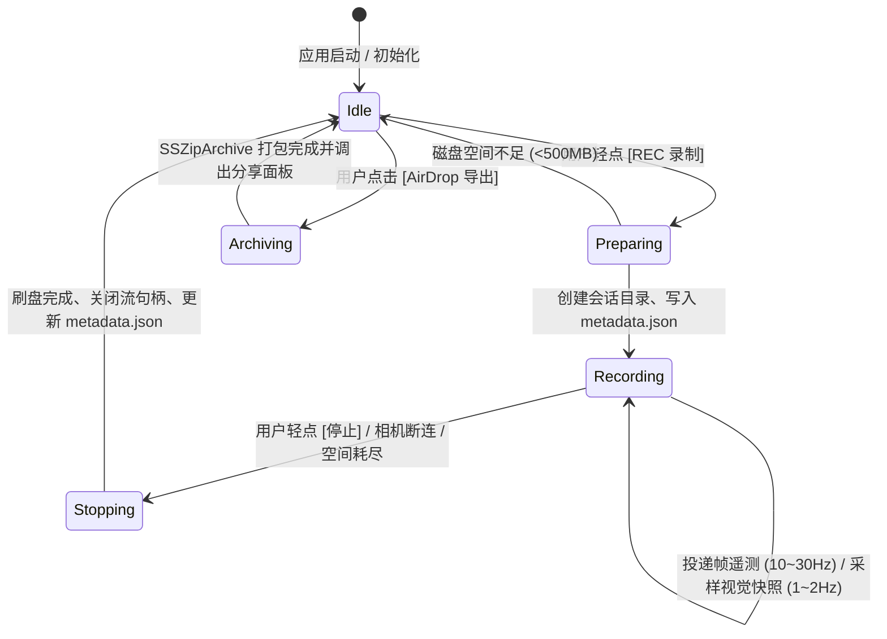

# 数据模型与存储架构设计：空间感知实测多模态数据采集与离线回放系统 (004-perception-data-collector)

**特性分支**: `004-perception-data-collector`  
**创建日期**: 2026-09-23  
**状态**: 计划中 (Planned)

---

## 一、 会话目录存储物理结构

所有实测会话在 iOS 沙盒的 `Documents/Sessions/` 目录下按时间戳隔离存储：

```text
<Application_Sandbox>/Documents/Sessions/
└── session_20260923_183015_Veaming/
    ├── metadata.json              // 会话元数据信息（设备、系统版本、总帧数等）
    ├── telemetry.jsonl             // 核心时序遥测流（每帧一行，微秒级时间戳对齐）
    ├── system.log                  // 会话期间产生的文本运行日志
    ├── frames/                     // 抽样全景图像快照（1~2Hz）
    │   ├── 1727087415100.jpg
    │   └── 1727087415600.jpg
    └── depths/                     // 匹配的深度矩阵快照（1~2Hz）
        ├── 1727087415100.bin
        └── 1727087415600.bin
```

打包导出的文件格式为单体 `.zip`：
`session_20260923_183015_Veaming.zip`

---

## 二、 核心数据模型定义 (Swift Codable Entities)

### 1. 会话元数据实体 (`SessionMetadata`)

记录本次采集的宏观运行环境与统计信息，存储于 `metadata.json` 中：

```swift
/// 采集会话的全局元信息实体
public struct SessionMetadata: Codable, Sendable {
    /// 唯一会话标识符 (例如: "session_20260923_183015")
    public let sessionId: String
    /// 会话开始时间戳 (毫秒)
    public let startTimeMs: Int64
    /// 会话结束时间戳 (毫秒, 录制中为 nil)
    public var endTimeMs: Int64?
    /// 录制持续时长 (秒)
    public var durationSeconds: Double
    /// 累计记录的遥测帧总数
    public var totalTelemetryFrames: Int
    /// 累计记录的图像快照总数
    public var totalImageSnapshots: Int
    /// 采集设备信息 (例如: "iPhone 15, iOS 17.5")
    public let deviceInfo: String
    /// 应用版本号
    public let appVersion: String
    /// 算法关键初始参数快照 (供离线对齐基准)
    public let algorithmConfig: [String: String]
}
```

---

### 2. 帧级时序遥测快照 (`FrameTelemetryRecord`)

每一帧由推理与规划流水线产生，通过 JSONL 格式流式持久化。每一行是一个独立的 JSON 字符串：

```swift
/// 单一感知帧的全量时序遥测快照
public struct FrameTelemetryRecord: Codable, Sendable {
    /// 毫秒级对齐时间戳 (自 1970 纪元毫秒数，对齐 PanoramicFrame.timestampMs)
    public let timestampMs: Int64
    /// 视频帧连续序号
    public let frameIndex: Int
    
    // MARK: - 传感器与几何姿态
    /// 相机 IMU 绝对姿态四元数 (用于高保真重力校准与点云反算)
    public let quaternion: QuaternionRecord
    /// 相机 IMU 欧拉角 (度: roll, pitch, yaw)
    public let eulerAngles: EulerAnglesRecord
    /// 相机 IMU 加速度向量 (m/s^2)
    public let acceleration: SIMD3Record
    /// RANSAC 地面拟合平面方程系数 [A, B, C, D] (Ax + By + Cz + D = 0)
    public let groundPlane: [Float]
    /// 估算的相机离地高度 (米)
    public let cameraHeight: Float
    
    // MARK: - 障碍物检测与过滤输出
    /// 原始检出的所有障碍物列表
    public let rawObstacles: [ObstacleRecord]
    /// 经过业务前向扇区 (|azimuth| <= 65° & distance <= 1.0m) 过滤后的危险障碍物列表
    public let hazardObstacles: [ObstacleRecord]
    /// 触发音频告警的最近目标坐标 (若无则为 nil)
    public let activeObstacleTarget: SIMD3Record?
    
    // MARK: - 路径规划与可通行性输出
    /// 通行走廊是否开通
    public let isPassable: Bool
    /// 安全前向纵深 (米)
    public let safeDepth: Float
    /// 推荐起步偏航角 (度)
    public let recommendedHeading: Float
    /// 提取出的航路点序列 (3D 坐标列表)
    public let waypoints: [SIMD3Record]
    /// 驱动前方领路脚步声的首航路点相对坐标 (若前方受阻则为 nil)
    public let activeNavigationTarget: SIMD3Record?
    
    // MARK: - 性能度量
    /// 该帧推理与几何端到端计算耗时 (毫秒)
    public let processingLatencyMs: Double
    /// 是否存在伴随保存的图像快照 (用于回放时快速索引图片)
    public let hasImageSnapshot: Bool
}

/// 兼容 Codable 的三维空间向量记录
public struct SIMD3Record: Codable, Sendable {
    public let x: Float
    public let y: Float
    public let z: Float
}

/// 兼容 Codable 的四元数姿态记录 (对齐 simd_quatf)
public struct QuaternionRecord: Codable, Sendable {
    public let x: Float
    public let y: Float
    public let z: Float
    public let w: Float
}

/// 兼容 Codable 的欧拉角记录
public struct EulerAnglesRecord: Codable, Sendable {
    public let roll: Float
    public let pitch: Float
    public let yaw: Float
}

/// 兼容 Codable 的障碍物快照
public struct ObstacleRecord: Codable, Sendable {
    public let id: Int
    public let position: SIMD3Record
    public let size: SIMD3Record
    public let distance: Float
    public let azimuth: Float
    public let category: String
}
```

---

### 3. 会话摘要视图实体 (`SessionSummaryItem`)

供主界面与历史抽屉管理视图（SwiftUI）渲染列表与交互使用：

```swift
/// 历史会话展示项
public struct SessionSummaryItem: Identifiable, Sendable {
    public var id: String { sessionId }
    public let sessionId: String
    public let folderURL: URL
    public let createdAt: Date
    public let durationFormatted: String
    public let sizeFormatted: String
    public let totalFrames: Int
    public let isCurrentlyRecording: Bool
}
```

---

## 三、 状态转换机模型 (State Machine)

数据采集器的生命周期严格由状态机管理，杜绝并发竞争：



---

## 四、 存储安全与容量配额策略

1. **写盘阻断线（500MB）**：
   - 每次准备录制前，通过 `URL.resourceValues(forKeys: [.volumeAvailableCapacityForImportantUsageKey])` 评估空间。
   - 剩余空间 $< 500\text{MB}$ 时，禁止启动录制并发出警报；若录制中触发阈值，立即自动优雅关闭。
2. **写盘缓冲区水位线**：
   - 内部内存队列采用有界环形缓冲（最大容纳 60 帧未写盘遥测）。
   - 若遇到 I/O 拥塞，优先丢弃大型 JPEG 图像快照，绝不丢弃关键的时序 JSONL 记录。
3. **文件写入原子性**：
   - `telemetry.jsonl` 使用 `FileHandle` 追加写入并在 `didStop` 时执行 `synchronize()`；
   - 保证进程被杀死时已写入的条目完整无损。
