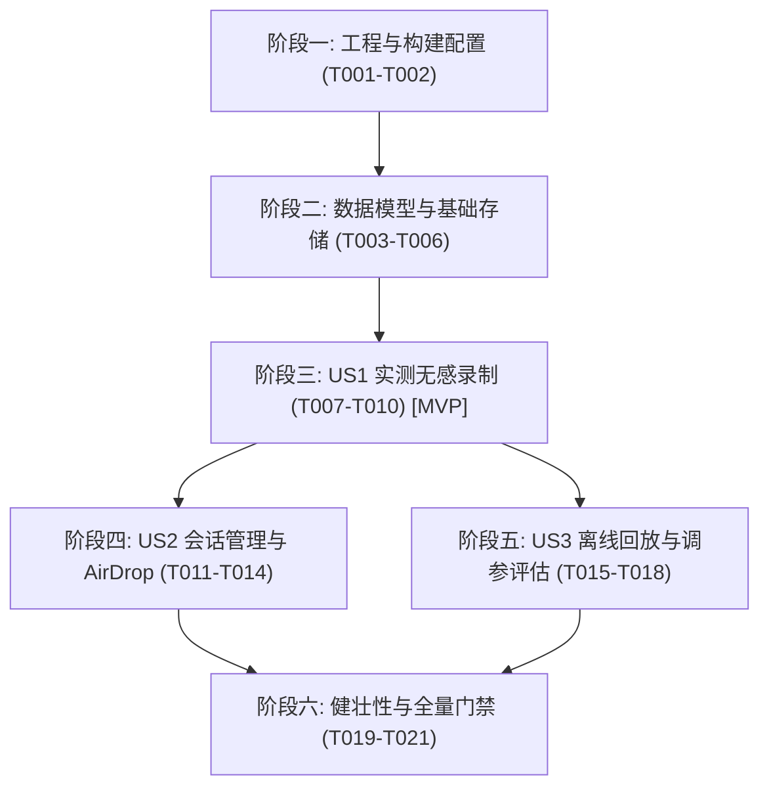

# 任务清单：空间感知实测多模态数据采集与离线回放系统 (004-perception-data-collector)

**特性分支**: `004-perception-data-collector`  
**输入规划**: 来自 `specs/004-perception-data-collector/plan.md` 的架构设计与既有资产规约  
**前置条件**: `plan.md`, `spec.md`, `research.md`, `data-model.md`, `contracts/`, `quickstart.md`  

---

## 阶段一：基础设施与工程配置 (Phase 1: Setup)

**目标**: 配置构建描述文件与目录结构，挂载既有依赖库并生成统一 Xcode 工程配置。

- [X] T001 在项目工程配置 `WalkMate/project.yml` 中声明 `Collector` 源码目录与 `ReplayTests` 测试目标，配置对 `SSZipArchive.xcframework` 的链接与嵌入依赖
- [X] T002 运行 `xcodegen generate` 重新生成 `WalkMate/WalkMate.xcodeproj`，并在 `Tests/ReplayTests/` 下建立回放套件目录骨架

---

## 阶段二：核心基础资产与数据模型 (Phase 2: Foundational)

**目标**: 建立不可分割的基础数据实体、沙盒存储管理器与既有感知流水线的数据暴露钩子。此阶段为所有用户故事的硬性前置依赖。

- [X] T003 [P] 创建核心采集与遥测 Codable 数据模型 `WalkMate/Models/CollectorModels.swift`（包含 `SessionMetadata`、`FrameTelemetryRecord`、`QuaternionRecord`、`SIMD3Record`、`EulerAnglesRecord` 与 `SessionSummaryItem`）
- [X] T004 [P] 编写会话沙盒存储管理器单元测试 `Tests/AppTests/SessionStorageManagerTests.swift`（验证会话隔离目录创建、500MB 存储保护门限与目录枚举）
- [X] T005 实现会话沙盒存储管理器 `WalkMate/Core/Collector/SessionStorageManager.swift`（实现 `SessionStorageManagerProtocol`，负责 `Documents/Sessions/` 目录生命周期与空间检测）
- [X] T006 外科手术式扩展既有感知引擎 `WalkMate/Core/Engine/SpatialPerceptionEngine.swift`，增加内部状态数据回调钩子，允许采集器捕获每帧地面拟合参数 `[A, B, C, D]`、估算相机高度 `cameraHeight` 及当前 `DepthMatrix`

---

## 阶段三：用户故事 1 - 实测会话一键无感录制与自动持久化 (Phase 3: User Story 1 - Priority: P1) 🎯 MVP

**目标**: 实现独立后台异步写盘管道，流式落盘 10~30Hz 时序遥测 JSONL 与 1~2Hz 抽样视觉帧快照；主界面右上角升级为录制启停胶囊按钮，录制期间音频与推流零卡顿。

**独立验收标准**:
连接相机并开启空间感知，点击主界面右上角 `[REC 录制]` 按钮，手持行走 30 秒后点击停止。检查沙盒生成带有完整时间戳的 `session_xxx` 独立目录，包含格式合法的 `telemetry.jsonl` 与抽样图像快照，录制全程空间音频无卡顿、视频推流不掉帧。

### 阶段三测试任务 (Tests)
- [X] T007 [P] [US1] 编写数据采集协调器单元测试 `Tests/AppTests/PerceptionDataCollectorTests.swift`（验证状态机流转、环形队列异步缓冲、10~30Hz 遥测与 1~2Hz 视觉分级采样、JSONL 流式写入及入队延迟基准断言）

### 阶段三实现任务 (Implementation)
- [X] T008 [US1] 实现空间感知数据采集协调器 `WalkMate/Core/Collector/PerceptionDataCollector.swift`（实现 `PerceptionDataCollectorProtocol`，集成 Utility 专用写盘队列、环形内存缓冲区、JSONL 追加流与 JPEG/二进制深度图采样）
- [X] T009 [US1] 在主界面视图模型 `CameraViewModel` 中注入 `PerceptionDataCollector`，挂载每帧数据转发与录制时长心跳绑定，并在捕获相机断连或连接失败时主动触发采集器安全停止（`WalkMate/App/ContentView.swift`）
- [X] T010 [US1] 将主界面右上角原“拷贝日志”按钮直接升级替换为实测采集控制胶囊按钮 `[REC 录制 / 00:00]`，显式保证触控尺寸不低于 48x48 像素，提供静态无障碍标签与提示，并在启停时刻通过 `UIAccessibility.post(notification: .announcement)` 播报状态，避免动态秒数轮询打断读屏（`WalkMate/App/ContentView.swift`）

---

## 阶段四：用户故事 2 - 采集会话管理与一键 AirDrop 导出 (Phase 4: User Story 2 - Priority: P2)

**目标**: 提供沙盒历史会话列表浏览、调用既有 `SSZipArchive` 极速打包，并呼出系统原生 `UIActivityViewController` 隔空投送（AirDrop）至开发机，同时整合原有文本日志复制功能。

**独立验收标准**:
在非录制状态下轻点右上角复合按钮调出会话管理面板，列表清晰展示历史记录；点击任一会话的导出按钮，系统在 3 秒内完成打包并弹出 AirDrop 分享面板，Mac 接收后解压可得完整目录文件。

### 阶段四测试任务 (Tests)
- [X] T011 [P] [US2] 在 `Tests/AppTests/SessionStorageManagerTests.swift` 中补充基于既有 `SSZipArchive.xcframework` 的 zip 压缩归档打包与解压校验单测

### 阶段四实现任务 (Implementation)
- [X] T012 [US2] 在 `WalkMate/Core/Collector/SessionStorageManager.swift` 中实现 `createArchive(sessionId:progress:)`，直接调用既有的 `SSZipArchive.createZipFile` 执行后台异步压缩生成 `.zip` 归档
- [X] T013 [US2] 创建实测会话管理与 AirDrop 导出半屏抽屉视图 `WalkMate/App/Views/SessionManagementSheet.swift`（展示会话时间、大小、时长，提供单项一键 AirDrop 导出、批量清理，并保留原有纯文本日志复制卡片）
- [X] T014 [US2] 在主界面 `WalkMate/App/ContentView.swift` 中集成 `SessionManagementSheet`，实现非录制态点按弹出管理抽屉，录制完成自动提示查看或分享

---

## 阶段五：用户故事 3 - 离线数据集回放与算法精度验证基准 (Phase 5: User Story 3 - Priority: P3)

**目标**: 在 Mac 开发端构建原生的 XCTest 回放测试套件，解压真实路测数据包后可逐帧回灌并单步调试几何拟合与路径规划算法，输出调参前后的航路点生成率量化报告。

**独立验收标准**:
在 Mac 终端运行 `xcodebuild test -only-testing:ReplayTests`，套件加载包含“前方受阻”的样本会话，逐帧模拟灌入既有算法，调整地面容差与通行门限后重新运行，自动化输出对比报告并确认航路点生成率从 $<10\%$ 提升至 $80\%$ 以上。

### 阶段五测试与实现任务 (Implementation & Test Harness)
- [ ] T015 [P] [US3] 创建离线回放数据加载驱动器 `Tests/ReplayTests/PerceptionReplayer.swift`（实现 `PerceptionReplayerProtocol`，解析解压会话目录下的 `metadata.json`、`telemetry.jsonl` 与深度/图像快照）
- [ ] T016 [US3] 编写离线回放测试套件 `Tests/ReplayTests/PerceptionReplayTests.swift`，构建模拟帧输入流，直接灌入既有的 `GroundPlaneEstimator`、`ObstacleDetector` 与 `PassageRoutePlanner`
- [ ] T017 [US3] 在 `Tests/ReplayTests/PerceptionReplayTests.swift` 中增加算法调参消融对比与统计评估逻辑，计算并输出优化前后的航路点生成率（Passable Rate）与障碍物虚警变化
- [ ] T018 [P] [US3] 在 `Tests/ReplayTests/Datasets/` 下建立标准测试样本目录规范与说明文档，并配置一组轻量级端到端合成实测回放样本

---

## 阶段六：系统收尾、健壮性防护与全量质量门禁 (Phase 6: Polish & Quality Gates)

**目标**: 完善极端异常边界防护，执行全量自动化静态分析与单元测试，确保零错误零警告。

- [ ] T019 [P] 在 `WalkMate/Core/Collector/PerceptionDataCollector.swift` 中完善存储空间低于 500MB 自动安全中止保护、相机断连被动中止保护、异常强退下的流式恢复逻辑以及单次录制 15 分钟滚动分片保护
- [ ] T020 运行全量单元测试套件（`AppTests`、`AudioTests`、`CameraTests`、`InferenceTests`、`GeometryTests`、`PerceptionTests`、`ReplayTests`），确保 100% 编译与逻辑通过（Zero Failures, Zero Errors）
- [ ] T021 审查全量代码注释与日志消息，确认完全符合项目宪章纯中文规范，更新规范追踪元数据

---

## 依赖关系与用户故事交付顺序 (Dependencies & Order)

### 并行执行机会 (Parallel Opportunities)
- **阶段二内部**: `T003`（数据模型）与 `T004`（存储单测）可并行开发；
- **阶段三内部**: `T007`（采集单测）可先于或与 `T008` 接口并行编写（TDD）；
- **阶段四内部**: `T011`（压缩单测）可与 `T013`（UI 抽屉视图）并行开发；
- **阶段五内部**: `T015`（回放驱动器）与 `T018`（样本集准备）可并行进行。

### 最小可行产品 (MVP 范围建议)
**阶段一 + 阶段二 + 阶段三 (T001 ~ T010)** 构成了完整的 MVP。在此范围内，真机已能无感完成 10~30Hz 遥测与 1~2Hz 图像的实测录制，测试人员已可通过沙盒文件查看完整的现场推演数据。
